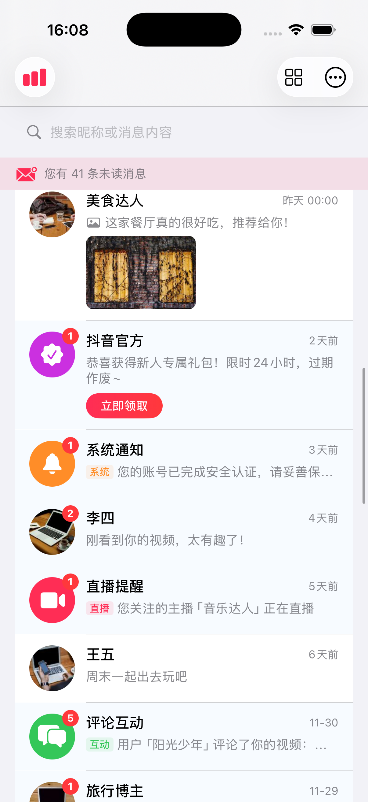
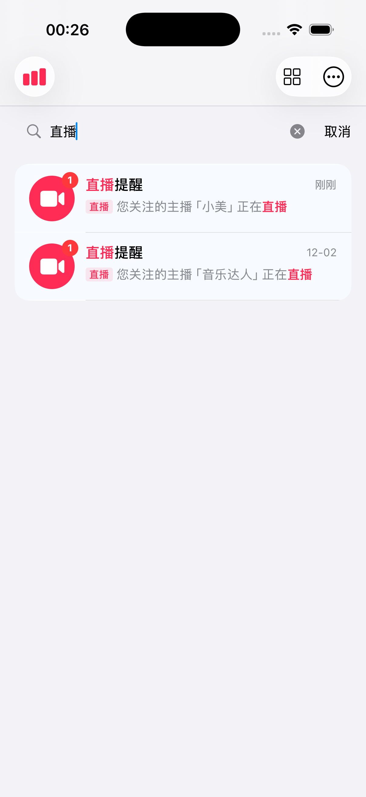
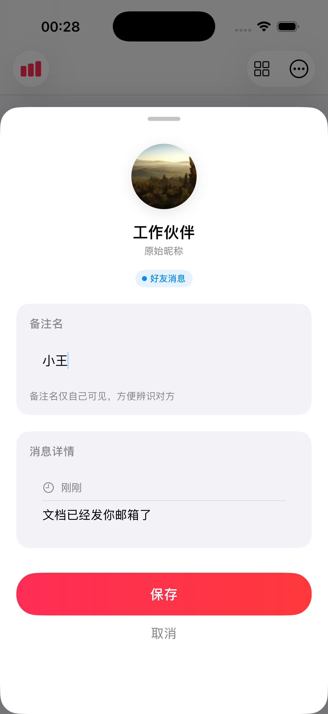
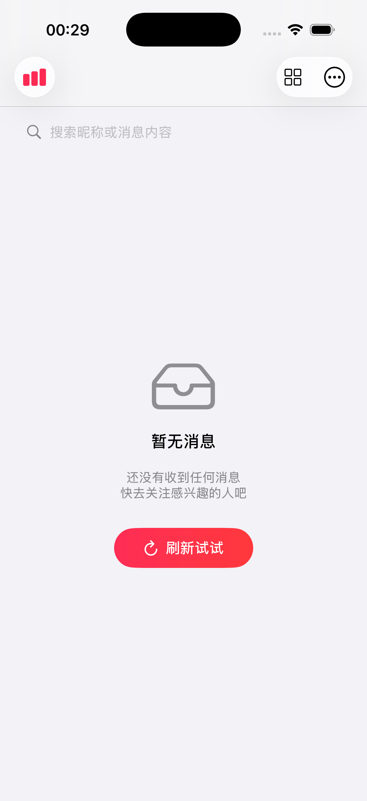
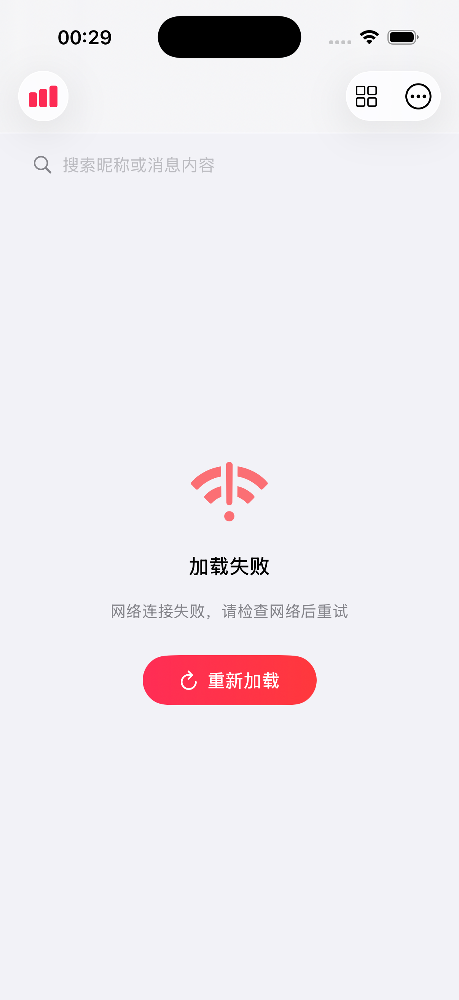
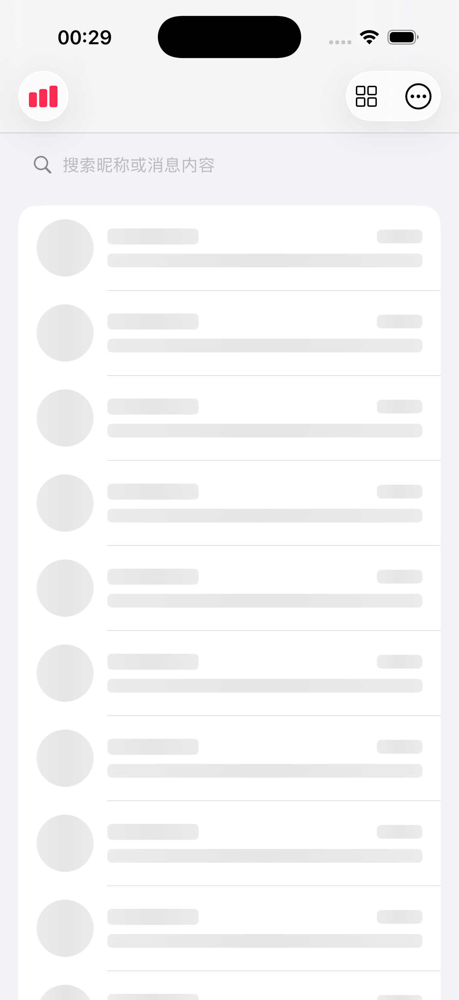
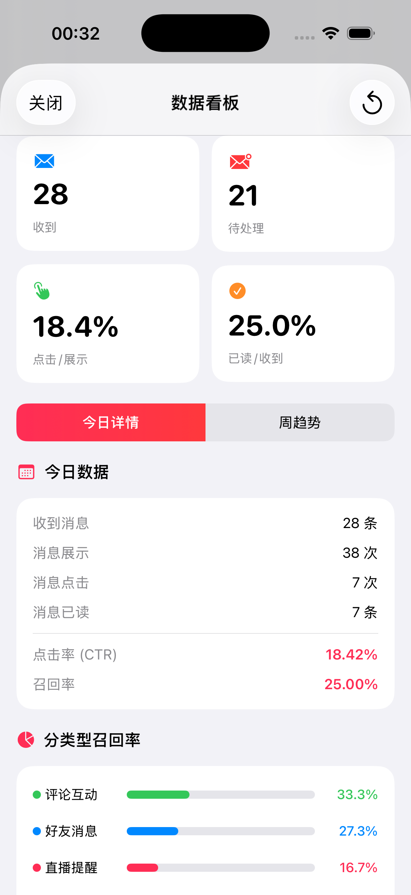
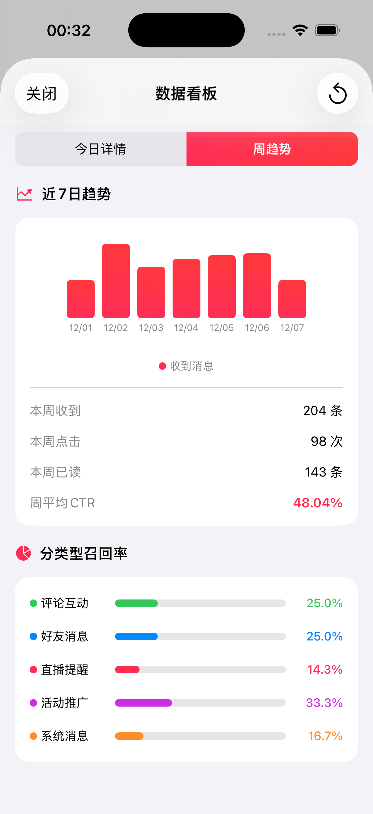

# 抖音简版消息列表

## 📱 项目简介

本项目是一个仿抖音消息列表的iOS应用，实现了消息体系的核心功能，包括消息展示、搜索、备注、数据统计等完整功能。项目采用 **SwiftUI + MVVM** 架构，使用 **原生 SQLite** 进行数据持久化。

### 核心功能

- 消息列表（好友消息 + 系统消息混排）
- 多种消息类型（文本/图片/运营按钮）
- 下拉刷新 / 上滑加载更多
- 消息搜索 + 关键词高亮
- 备注编辑 + SQLite持久化
- 自定义转场动画
- 消息推送模拟
- 数据统计看板
- Widget小组件模拟

---

## 📸 效果截图

### 消息列表

| 主列表 | 搜索高亮 |
|:------:|:-------:|
|  |  |

### 备注页

| 备注编辑 |
|:-------:|
|  |

### 空态与错误

| 空态页面 | 错误页面 | 骨架屏 |
|:-------:|:-------:|:-----:|
|  |  |  |

### 数据看板

| 概览卡片 | 周趋势 |
|:-------:|:-----:|
|  |  |

### Widget模拟

| 小组件/横幅展示 |
|:---------:|
|  |

---

## 🏗️ 项目结构

```
test_msg/
├── 📁 Models/                        # 数据模型层
│   └── Message.swift                 # 消息模型（类型、内容、时间格式化）
│
├── 📁 Views/                         # 视图层 (V)
│   ├── MessageListView.swift         # 消息列表主页面
│   ├── MessageCellView.swift         # 消息单元格（支持多内容类型）
│   ├── MessageDetailView.swift       # 消息详情/备注页（自定义转场）
│   ├── RemarkView.swift              # 备注编辑页
│   ├── EmptyStateView.swift          # 空态/错误状态页
│   ├── StatsDashboardView.swift      # 数据统计看板
│   └── 📁 Components/
│       ├── SearchBarView.swift       # 搜索框组件
│       ├── SkeletonListView.swift    # 骨架屏加载
│       ├── HighlightedTextView.swift # 关键词高亮文本
│       └── MessageWidgetView.swift   # Widget小组件模拟
│
├── 📁 ViewModels/                    # 视图模型层 (VM)
│   ├── MessageListViewModel.swift    # 列表业务逻辑
│   └── RemarkViewModel.swift         # 备注业务逻辑
│
├── 📁 Services/                      # 服务层
│   ├── DatabaseManager.swift         # SQLite数据库管理 + Migration
│   ├── MessageCenter.swift           # 消息分发中心（定时推送）
│   ├── MockDataService.swift         # 模拟数据服务（分页）
│   ├── NetworkManager.swift          # 网络管理（弱网/超时模拟）
│   └── AnalyticsManager.swift        # 数据统计埋点
│
├── 📁 Resources/
│   └── messages.json                 # 本地模拟数据源（30条）
│
├── 📁 Assets.xcassets/               # 资源文件
├── ContentView.swift                 # 内容视图
└── test_msgApp.swift                 # App入口
```

---

## 🛠️ 技术方案

### 架构设计：MVVM

```
┌─────────────────────────────────────────────────────────────────┐
│                            View 层                               │
│   MessageListView / MessageCellView / MessageDetailView         │
│   • 纯UI展示，无业务逻辑                                          │
│   • 通过 @StateObject / @ObservedObject 绑定 ViewModel           │
└─────────────────────────────────────────────────────────────────┘
                                 │ @Published 数据绑定
                                 ▼
┌─────────────────────────────────────────────────────────────────┐
│                         ViewModel 层                             │
│   MessageListViewModel / RemarkViewModel                        │
│   • 处理业务逻辑                                                  │
│   • 管理状态（加载、刷新、错误）                                    │
│   • 调用 Service 层获取/存储数据                                   │
└─────────────────────────────────────────────────────────────────┘
                                 │
                                 ▼
┌─────────────────────────────────────────────────────────────────┐
│                          Service 层                              │
│   DatabaseManager / MockDataService / MessageCenter             │
│   • 数据持久化（SQLite）                                          │
│   • 网络请求模拟                                                  │
│   • 消息推送管理                                                  │
└─────────────────────────────────────────────────────────────────┘
                                 │
                                 ▼
┌─────────────────────────────────────────────────────────────────┐
│                          Model 层                                │
│   Message / MessageContent / MessageType                        │
│   • 纯数据结构定义                                                │
│   • Codable 支持 JSON 解析                                       │
└─────────────────────────────────────────────────────────────────┘
```

### 技术选型

| 技术点 | 选型 | 理由 |
|-------|------|------|
| UI框架 | SwiftUI | Apple推荐的声明式UI，代码简洁 |
| 架构模式 | MVVM | 与SwiftUI数据绑定天然契合 |
| 数据持久化 | 原生SQLite3 | 轻量级，无第三方依赖 |
| 响应式 | Combine | 处理消息推送订阅 |
| 异步处理 | async/await | Swift原生并发，代码清晰 |

### 数据库设计

```sql
-- 消息状态表（已读状态 + 置顶）
CREATE TABLE message_state (
    message_id TEXT PRIMARY KEY,
    is_read INTEGER DEFAULT 0,
    unread_count INTEGER DEFAULT 0,
    is_pinned INTEGER DEFAULT 0,      -- V2新增
    updated_at REAL
);

-- 备注表
CREATE TABLE message_remark (
    message_id TEXT PRIMARY KEY,
    nickname TEXT,
    remark TEXT,
    created_at REAL,
    updated_at REAL
);
```

### 消息内容类型

```swift
enum MessageContentType {
    case text      // 纯文本
    case image     // 携带图片
    case button    // 运营按钮
}

struct MessageContent {
    let type: MessageContentType
    let text: String
    let imageURL: String?      // 图片消息
    let buttonText: String?    // 按钮文案
    let buttonAction: String?  // 按钮动作
}
```

### 时间文案规则

| 时间范围 | 显示格式 | 示例 |
|---------|---------|------|
| < 1分钟 | 刚刚 | 刚刚 |
| < 1小时 | xx分钟前 | 5分钟前 |
| 今天 | HH:mm | 14:30 |
| 昨天 | 昨天 HH:mm | 昨天 20:15 |
| < 7天 | x天前 | 3天前 |
| 其他 | MM-dd | 12-01 |

---

## 🔥 技术难点分析

### 难点1：SQLite Schema Migration

**问题描述**：
版本迭代时需要添加新字段（如 `is_pinned`），同时兼容已有用户数据，不能丢失。

**解决方案**：
使用 `PRAGMA user_version` 管理版本号，启动时检测并执行增量迁移。

**核心代码**：`Services/DatabaseManager.swift`

```swift
private let DB_VERSION = 2

private func runMigrations() {
    let currentVersion = getDatabaseVersion()
    
    if currentVersion < 1 {
        migrateToV1()  // 创建基础表
    }
    if currentVersion < 2 {
        migrateToV2()  // 添加 is_pinned 字段
    }
    
    setDatabaseVersion(DB_VERSION)
}

private func migrateToV2() {
    // 检查列是否已存在，避免重复添加
    if !columnExists(table: "message_state", column: "is_pinned") {
        executeSQL("ALTER TABLE message_state ADD COLUMN is_pinned INTEGER DEFAULT 0;")
    }
}
```

---

### 难点2：自定义转场动画（避免系统动画冲突）

**问题描述**：
使用 `fullScreenCover` 时，自定义的卡片动画与系统的模态动画冲突，导致退出时出现"先弹框消失，后灰色背景消失"的割裂感。

**解决方案**：
弃用 `fullScreenCover`，改用 `ZStack` 覆盖层，完全自主控制动画时序。

**核心代码**：`Views/MessageListView.swift` + `Views/MessageDetailView.swift`

```swift
// MessageListView - 使用 ZStack 覆盖
var body: some View {
    ZStack {
        NavigationStack { ... }
        
        // 自定义覆盖层，不使用系统 sheet/fullScreenCover
        if showDetailSheet, let message = selectedMessage {
            MessageDetailView(...)
                .transition(.identity)
                .zIndex(1)
        }
    }
}

// MessageDetailView - 分离背景和卡片透明度
@State private var backgroundOpacity: Double = 0
@State private var cardOpacity: Double = 0

private func dismissWithAnimation() {
    withAnimation(.easeOut(duration: 0.25)) {
        backgroundOpacity = 0   // 背景同步消失
        cardOpacity = 0         // 卡片同步消失
        offset = CGSize(width: 0, height: 200)
    }
    DispatchQueue.main.asyncAfter(deadline: .now() + 0.25) {
        isPresented = false
    }
}
```

---

### 难点3：搜索关键词高亮

**问题描述**：
SwiftUI 的 `Text` 不支持部分文字样式，需要实现关键词高亮（不同颜色/加粗）。

**解决方案**：
将文本按关键词位置拆分为多段，使用 `Text` 拼接（`+` 运算符）实现混合样式。

**核心代码**：`Views/Components/HighlightedTextView.swift`

```swift
struct HighlightedTextView: View {
    let text: String
    let keyword: String
    
    var body: some View {
        let parts = splitText()
        
        // 使用 reduce 拼接多个 Text
        parts.reduce(Text("")) { result, part in
            if part.isHighlighted {
                return result + Text(part.text)
                    .foregroundColor(.pink)
                    .fontWeight(.semibold)
            } else {
                return result + Text(part.text)
            }
        }
    }
    
    private func splitText() -> [(text: String, isHighlighted: Bool)] {
        // 遍历查找关键词，拆分为高亮和非高亮片段
        var result: [(String, Bool)] = []
        while let range = text.range(of: keyword, options: .caseInsensitive) {
            // 前缀（不高亮）
            result.append((prefix, false))
            // 关键词（高亮）
            result.append((match, true))
        }
        return result
    }
}
```

---

### 难点4：消息实时推送 + UI同步

**问题描述**：
定时器推送新消息时，需要：1) 插入列表顶部 2) 滚动到顶部 3) 更新未读数，且保证动画流畅。

**解决方案**：
使用 `Combine` 的 `@Published` 属性发布消息，ViewModel 订阅并处理。

**核心代码**：`Services/MessageCenter.swift` + `ViewModels/MessageListViewModel.swift`

```swift
// MessageCenter - 发布新消息
final class MessageCenter: ObservableObject {
    @Published var latestMessage: Message?
    
    func startPushing(interval: TimeInterval = 5.0) {
        timer = Timer.scheduledTimer(withTimeInterval: interval, repeats: true) { _ in
            self.pushNewMessage()
        }
    }
    
    func pushNewMessage() {
        let message = generateRandomMessage()
        DispatchQueue.main.async {
            self.latestMessage = message
        }
    }
}

// ViewModel - 订阅并处理
private func setupMessageCenterSubscription() {
    messageCenter.$latestMessage
        .compactMap { $0 }
        .receive(on: DispatchQueue.main)
        .sink { [weak self] newMessage in
            self?.handleNewMessage(newMessage)
        }
        .store(in: &cancellables)
}

private func handleNewMessage(_ message: Message) {
    withAnimation(.spring(response: 0.3, dampingFraction: 0.8)) {
        messages.insert(message, at: 0)
        updateUnreadCount()
        scrollToTop = true  // 触发滚动
    }
}
```

---

### 难点5：弱网/超时处理

**问题描述**：
需要模拟网络请求的超时、失败场景，并展示对应UI状态。

**解决方案**：
封装带超时控制的异步请求方法，使用 `withCheckedThrowingContinuation` 转换回调为 async/await。

**核心代码**：`Services/NetworkManager.swift`

```swift
func simulateRequest<T>(
    timeout: TimeInterval = 5.0,
    simulateDelay: TimeInterval = 1.0,
    failureRate: Double = 0.1,
    operation: @escaping () -> T
) async throws -> T {
    
    let startTime = Date()
    
    return try await withCheckedThrowingContinuation { continuation in
        DispatchQueue.global().asyncAfter(deadline: .now() + simulateDelay) {
            // 超时检查
            if Date().timeIntervalSince(startTime) > timeout {
                continuation.resume(throwing: NetworkError.timeout)
                return
            }
            
            // 随机失败（模拟弱网）
            if Double.random(in: 0...1) < failureRate {
                continuation.resume(throwing: NetworkError.noConnection)
                return
            }
            
            // 成功返回
            continuation.resume(returning: operation())
        }
    }
}
```

---

### 难点6：消息Cell多类型自适应布局

**问题描述**：
同一个Cell需要展示三种不同内容：纯文本（单行）、图片（文本+图片）、运营按钮（文本+按钮），高度需自适应。

**解决方案**：
使用 `@ViewBuilder` + `switch` 根据内容类型返回不同布局，SwiftUI 自动计算高度。

**核心代码**：`Views/MessageCellView.swift`

```swift
@ViewBuilder
private var contentPreview: some View {
    switch message.content.type {
    case .text:
        // 单行文本
        HStack {
            messageTypeTag
            Text(message.content.text).lineLimit(1)
        }
        
    case .image:
        // 文本 + 图片预览
        VStack(alignment: .leading, spacing: 6) {
            HStack {
                Image(systemName: "photo")
                Text(message.content.text)
            }
            AsyncImage(url: URL(string: imageURL))
                .frame(width: 120, height: 80)
                .cornerRadius(8)
        }
        
    case .button:
        // 文本 + 运营按钮
        VStack(alignment: .leading, spacing: 8) {
            Text(message.content.text).lineLimit(2)
            Button(buttonText) { ... }
                .buttonStyle(.borderedProminent)
        }
    }
}
```

---

## 🚀 运行说明

### 环境要求

- Xcode 15.0+
- iOS 17.0+
- macOS Ventura 13.0+

### 运行步骤

1. 克隆项目
```bash
git clone <repository-url>
cd test_msg
```

2. 用 Xcode 打开项目
```bash
open test_msg.xcodeproj
```

3. 选择模拟器

4. 点击运行 (⌘R)

### 添加JSON数据源

确保 `Resources/messages.json` 已添加到项目：
1. 在 Xcode 中选择 `messages.json`
2. 右侧 File Inspector → Target Membership 勾选 `test_msg`

---

## 📊 功能演示

### 基础功能
- 消息列表展示（好友/系统/直播/评论/运营）
- 未读角标 + 未读背景高亮
- 置顶消息（📌图标）
- 下拉刷新 / 上滑加载更多

### 搜索功能
- 支持搜索昵称 + 消息内容
- 关键词粉色高亮显示

### 备注功能
- 点击消息进入备注页
- 编辑并保存备注（SQLite持久化）
- 下滑手势退出

### 消息推送
- 每5秒自动推送新消息
- 手动推送（右上角菜单）
- 新消息自动滚动到顶部

### 数据看板
- 今日消息/未读数/CTR/已读率
- 近7日趋势图
- 分类型召回率

### Widget模拟
- 小组件（带脉冲动画）
- 通知横幅
- 点击跳转消息页

